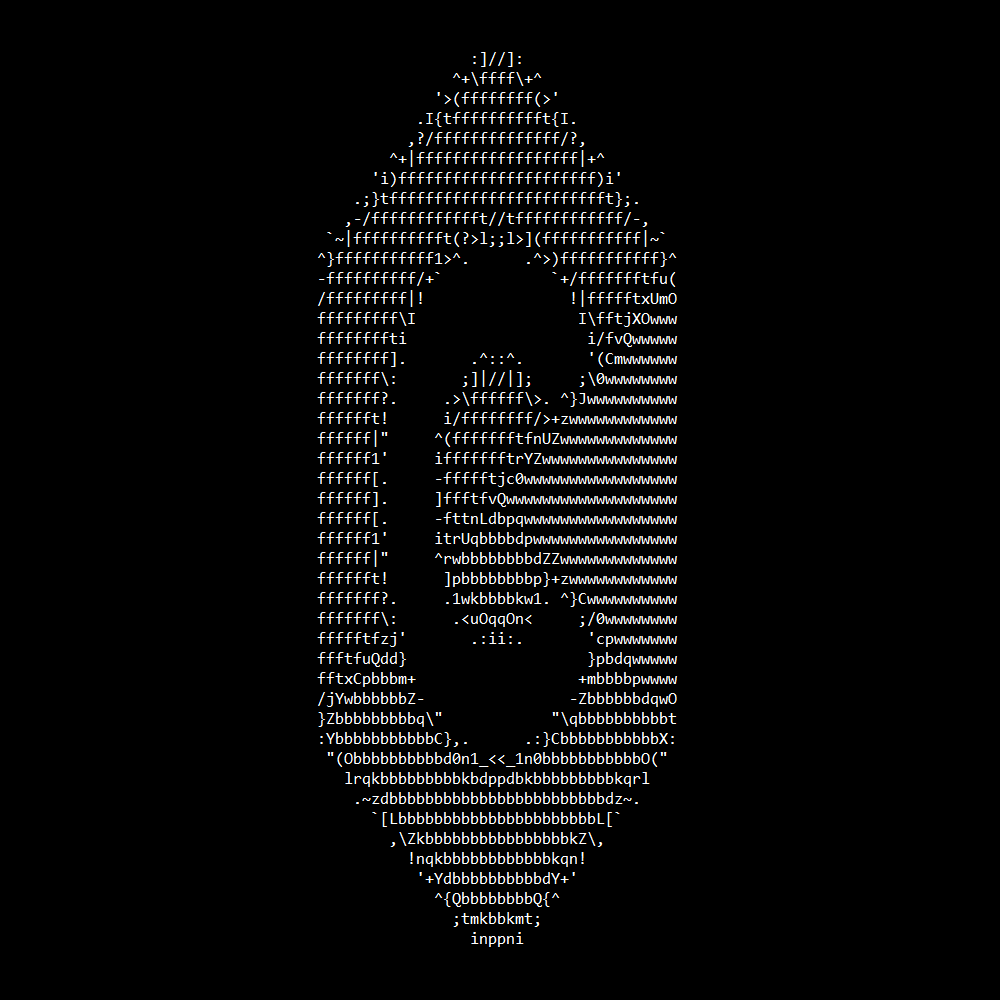
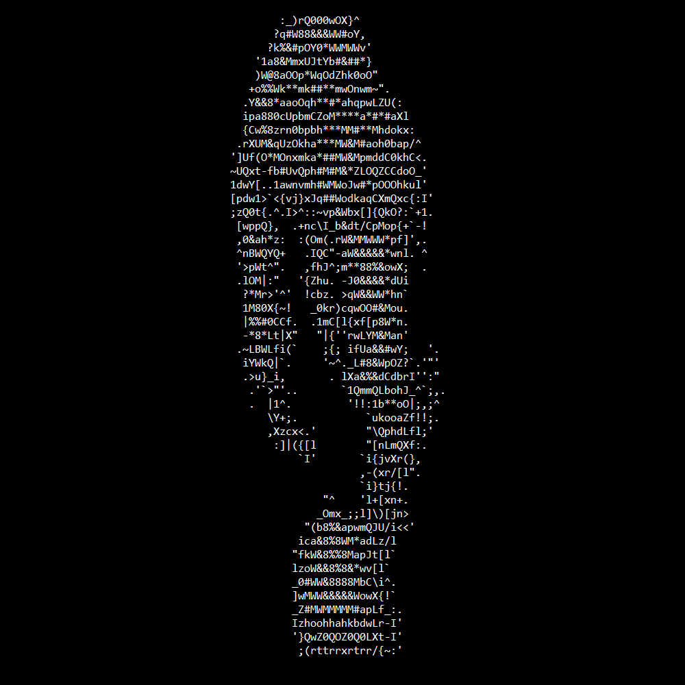
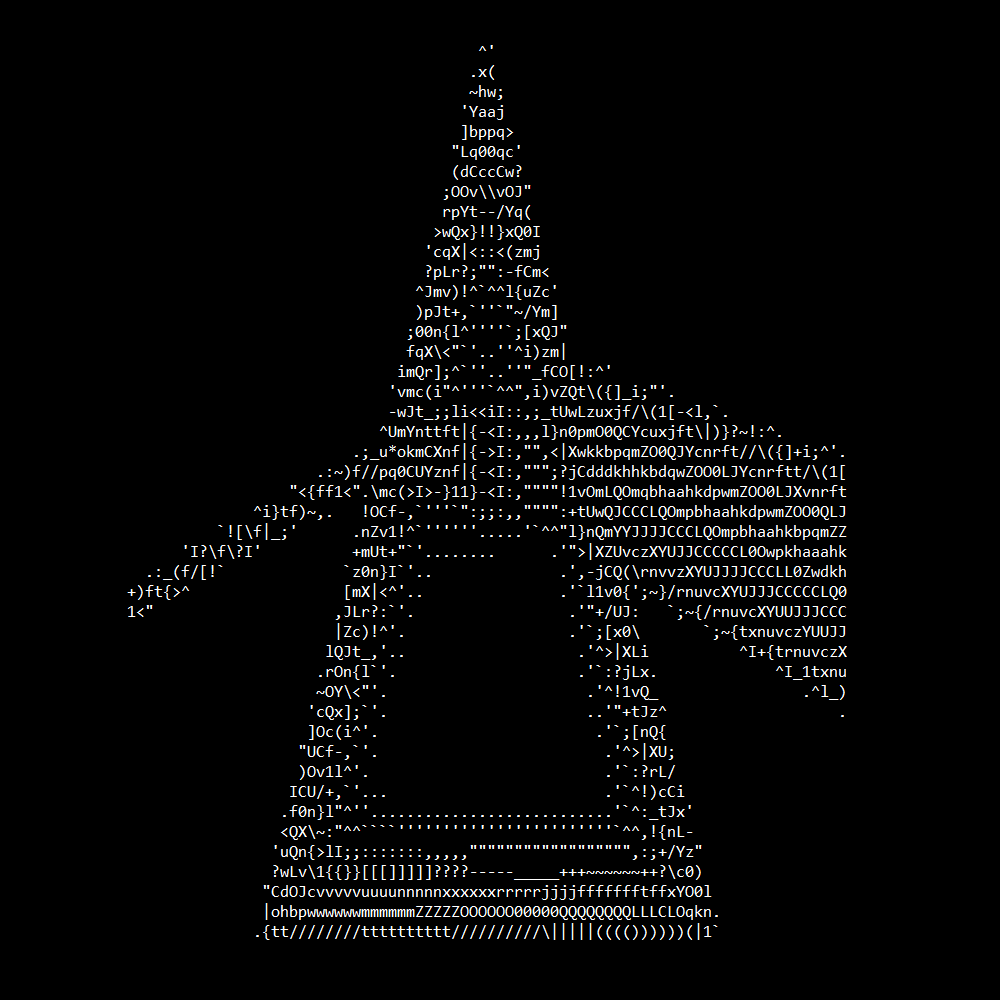
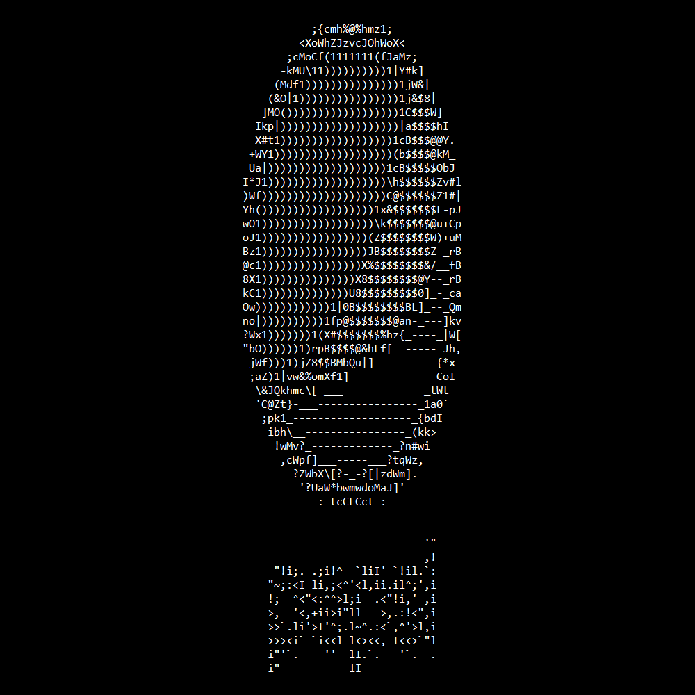
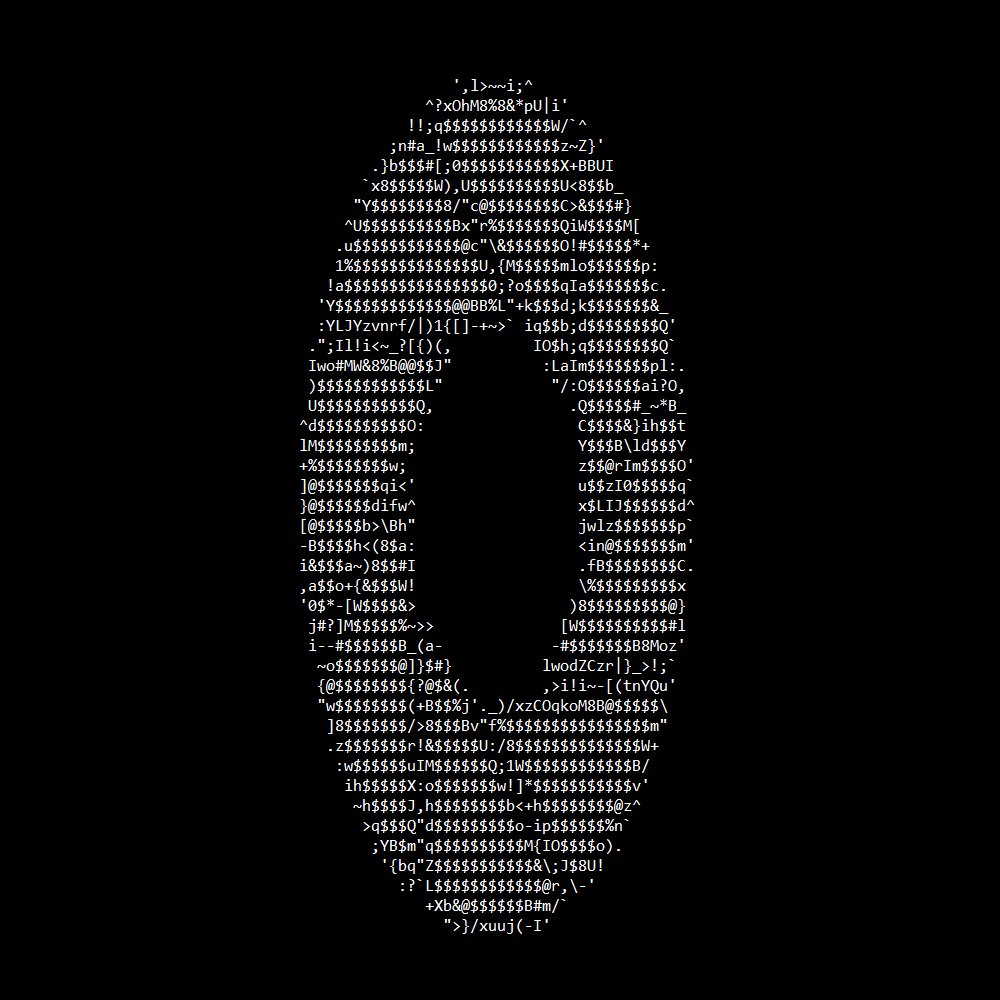

<div align="center">
  
## 
*A command-line tool for converting images to ASCII art*
  
[](https://github.com/JosefVesely/img2ascii)
[](https://github.com/JosefVesely/img2ascii/blob/main/LICENSE)
[](https://github.com/JosefVesely/img2ascii/stargazers)

</div>

## 🛠️ Installation

```sh
# Clone the repository
git clone https://github.com/JosefVesely/img2ascii

# Navigate to the project directory
cd img2ascii

# Compile the program
make
```

## 🚀 Usage

Run using the following syntax:

```md
img2ascii [options] -i <FILE> [-o <FILE>]
```

### Options:

| Short | Long      | Parameter | Description                                   |
|-------|-----------|-----------|-----------------------------------------------|
| -i    | --input   | *File*    | Path of the input image file ***(required)*** |
| -o    | --output  | *File*    | Path of the output file                       |
| -w    | --width   | *Number*  | Width of the output image                     |
| -c    | --chars   | *String*  | Characters to be used for the ASCII image     |
| -p    | --print   |           | Print the output to the console               |
| -r    | --reverse |           | Reverse the string of characters              |

## 🧩 Examples

| Input                                            | Output                                           |
|--------------------------------------------------|--------------------------------------------------|
|              |       |
| `img2ascii -i images/c.png -w 40 -p`             |                                                  |
|         |  |
| `img2ascii -i images/monroe.jpg -w 35 -p -r`     |                                                  |
|     |  |
| `img2ascii -i images/pink_floyd.jpg -w 80 -p -r` |                                                  |
|          |   |
| `img2ascii -i images/pepsi.png -w 35 -p -r`      |                                                  |
|       |  |
| `img2ascii -i images/aperture.jpg -w 50 -p`      |                                                  |

## 🧪 Compatibility 

The supported image file formats are **PNG**, **JPEG** and **BMP**

This program has been tested and works on the following operating systems:

- **Windows 11**
- **Linux Mint 22**

## 🤝 Contributing

Contributions are welcome! Feel free to open an issue or submit a pull request

## 📜 License

This project is licensed under the [MIT License](https://github.com/JosefVesely/img2ascii/blob/main/LICENSE)